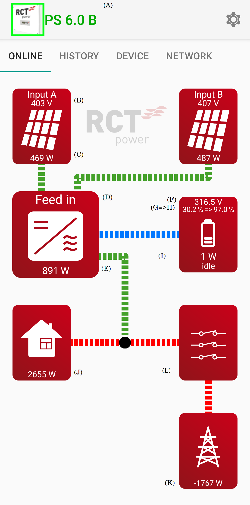
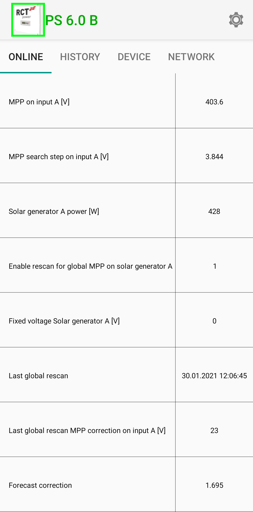
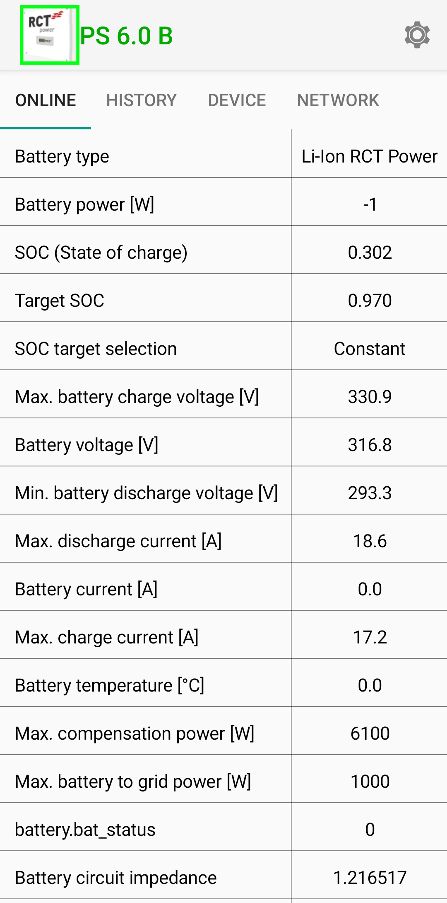
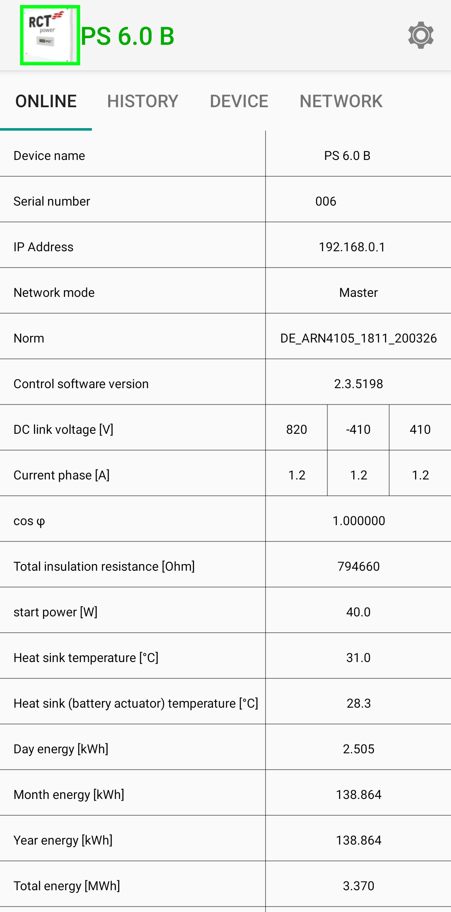
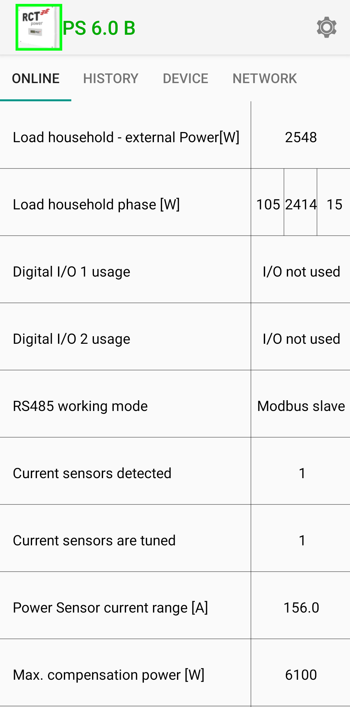
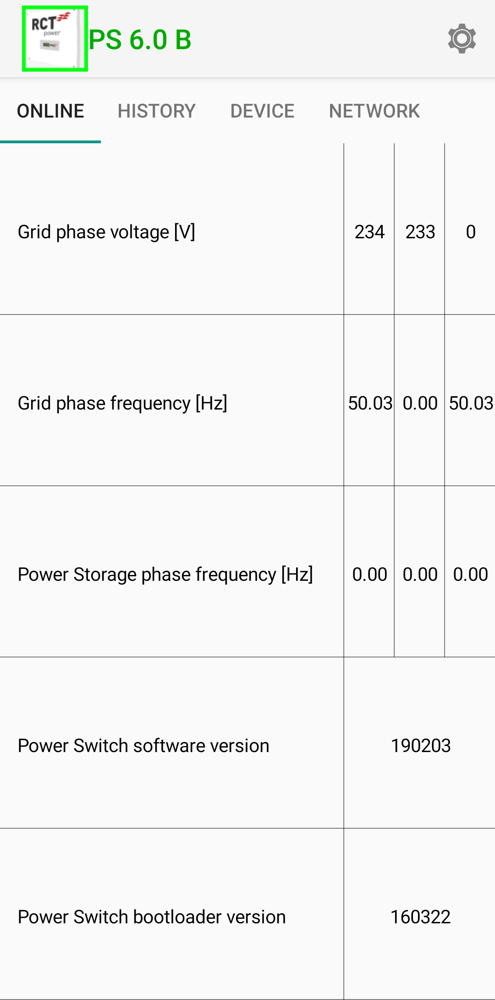
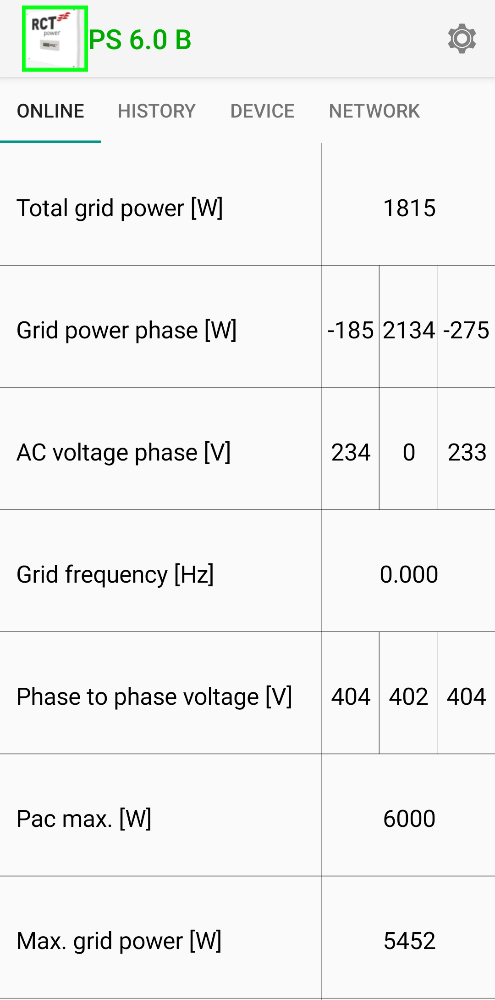

################################
Mapping the official app to OIDs
################################

By default, the official app does not display which OIDs the values it displays correspond to and it is not always
straight forward to find the correct OID in the :ref:`Registry`. This page provides a mapping for some of the values.

Screenshots where taken from the official Android App (see
`RCT Power App <https://www.rct-power.com/en/power-app-overview.html>`_ on the vendors homepage) version ``2.500`` from
12 Nov 2020, things may look different in newer versions or in the iOS app. The images have been slightly altered to
add annotations for easier referencing.

The setup shown here uses a single *RCT Power Storage DC 6.0* with *RCT Battery Storage* battery and *RCT Power
Switch* which is equipped with an *RCT Power Sensor*.

.. note::

   There is no guarantee that the information is correct, and it may change anytime without notice.

Main overview
*************
The main overview screen is the first thing the app displays after startup. It's showing a diagram that displays the
connected components (solar panels, the inverter, battery, power switch) as well as household power consumption and the
grid load. Coloured, dashed lines visualize both what is connected to which device and how much energy is flowing (by
speeding up or slowing down the animation as well as changing the colour to visualize generation and consumption).

Tapping one of the icons opens tabular views that go into detail about the selected element, more on that later. The
image has been edited to add markers, click to zoom:

         battery as well as some measurements about energy generation / consumption and battery state of charge.
         Annotations were added to refer to individual components.
   :height: 400

+--------+---------------------------------------+------------------------------------------------------------+
| Marker | OID                                   | Description                                                |
+========+=======================================+============================================================+
| (A)    | ``android_description``               | Device name                                                |
+--------+---------------------------------------+------------------------------------------------------------+
| (B)    | ``g_sync.u_sg_avg[0]``                | Solar generator A voltage (see :ref:`app_solar_generator`) |
+--------+---------------------------------------+------------------------------------------------------------+
| (C)    | ``dc_conv.dc_conv_struct[0].p_dc_lp`` | Solar Generator A power                                    |
+--------+---------------------------------------+------------------------------------------------------------+
| (D)    | ``prim_sm.state``                     | Inverter status (enum) (see :ref:`app_inverter`)           |
+--------+---------------------------------------+------------------------------------------------------------+
| (E)    |                                       |                                                            |
+--------+---------------------------------------+------------------------------------------------------------+
| (F)    | ``power_mng.u_acc_mix_lp``            | Battery voltage (see :ref:`app_battery`)                   |
+--------+---------------------------------------+------------------------------------------------------------+
| (G)    | ``battery.soc``                       | Battery State of Charge                                    |
+--------+---------------------------------------+------------------------------------------------------------+
| (H)    | ``battery.soc_target``                | Target State of Charge                                     |
+--------+---------------------------------------+------------------------------------------------------------+
| (I)    | ``g_sync.p_acc_lp``                   | Battery Power (negative for discharge)                     |
+--------+---------------------------------------+------------------------------------------------------------+
| (J)    | ``g_sync.p_ac_load_sum_lp``           | Load household - external Power (see :ref:`app_household`) |
+--------+---------------------------------------+------------------------------------------------------------+
| (K)    | ``g_sync.p_ac_grid_sum_lp``           | Total grid power (see :ref:`app_power_grid`)               |
+--------+---------------------------------------+------------------------------------------------------------+
| (L)    |                                       | Power Switch / Power Sensor (see :ref:`app_power_switch`)  |
+--------+---------------------------------------+------------------------------------------------------------+

Values fuer the second solar generator ("Input B") can be retrieved by changing the number in square brakets from ``0``
to ``1``:

* Voltage A: ``g_sync.u_sg_avg[0]``
* Voltage B: ``g_sync.u_sg_avg[1]``

.. note::

   The app will cycle between the status and the active events in the (D) position if there are active events, such as
   over- or undervoltage conditions.

.. _app_solar_generator:

Solar generator
***************
The inverter used here has two inputs for solar generators, which are usually strings of multiple solar cells.

         are explained in the table following this image.
   :height: 400

As before, ``[0]`` denotes generator A and ``[1]`` denotes generator B. Values without a number don't distinguish
between solar generators. The "Description" is the text in the left column of the table as displayed by the app.

+---------------------------------------------------+-------------------------------------------------+
| Description                                       | OID                                             |
+===================================================+=================================================+
| MPP on input A [V]                                | ``dc_conv.dc_conv_struct[0].u_target``          |
+---------------------------------------------------+-------------------------------------------------+
| MPP search step in input A [V]                    | ``dc_conv.dc_conv_struct[0].mpp.mpp_step``      |
+---------------------------------------------------+-------------------------------------------------+
| Solar generator A power [W]                       | ``dc_conv.dc_conv_struct[0].p_dc_lp``           |
+---------------------------------------------------+-------------------------------------------------+
| Enable rescan for global MPP on solar generator A | ``dc_conv.dc_conv_struct[0].mpp.enable_scan``   |
+---------------------------------------------------+-------------------------------------------------+
| Fixed voltage Solar generator A [V]               | ``dc_conv.dc_conv_struct[0].mpp.fixed_voltage`` |
+---------------------------------------------------+-------------------------------------------------+
| Last global rescan                                | ``dc_conv.last_rescan``                         |
+---------------------------------------------------+-------------------------------------------------+
| Last global rescan MPP correction on input A [V]  | ``dc_conv.dc_conv_struct[0].rescan_correction`` |
+---------------------------------------------------+-------------------------------------------------+
| Forecast correction                               | ``bat_mng.struct.k``                            |
+---------------------------------------------------+-------------------------------------------------+

.. _app_battery:

Battery
*******

         table following this image.
   :height: 400

The "Description" is the text in the left column of the table as displayed by the app.

+-----------------------------------------+------------------------------------------+
| Description                             | OID                                      |
+=========================================+==========================================+
| Battery type                            | ``power_mng.battery_type``               |
+-----------------------------------------+------------------------------------------+
| Battery power [W]                       | ``g_sync.p_acc_lp``                      |
+-----------------------------------------+------------------------------------------+
| SOC (State of charge)                   | ``battery.soc``                          |
+-----------------------------------------+------------------------------------------+
| Target SOC                              | ``battery.soc_target``                   |
+-----------------------------------------+------------------------------------------+
| SOC target selection                    | ``power_mng.soc_strategy``               |
+-----------------------------------------+------------------------------------------+
| Max. battery charge voltage [V]         | ``power_mng.maximum_charge_voltage``     |
+-----------------------------------------+------------------------------------------+
| Battery voltage [V]                     | ``power_mng.u_acc_mix_lp``               |
+-----------------------------------------+------------------------------------------+
| Min. battery discharge voltage [V]      | ``power_mng.minimum_discharge_voltage``  |
+-----------------------------------------+------------------------------------------+
| Max. discharge current [A]              | ``battery.maximum_discharge_current``    |
+-----------------------------------------+------------------------------------------+
| Battery current [A]                     | ``acc_conv.i_acc_lp_fast``               |
+-----------------------------------------+------------------------------------------+
| Max. charge current [A]                 | ``battery.maximum_charge_current``       |
+-----------------------------------------+------------------------------------------+
| Battery temperature [°C]                | ``battery.temperature``                  |
+-----------------------------------------+------------------------------------------+
| Max. compensation power [W]             | ``p_rec_lim[0]``                         |
+-----------------------------------------+------------------------------------------+
| Max. battery to grid power [W]          | ``p_rec_lim[1]``                         |
+-----------------------------------------+------------------------------------------+
| * "battery.bat_status" (older versions) | ``battery.bat_status``                   |
| * "Battery status bitfield" (new)       |                                          |
+-----------------------------------------+------------------------------------------+
| Battery circuit impedance               | ``battery.bat_impedance.impedance_fine`` |
+-----------------------------------------+------------------------------------------+

.. _app_inverter:

Inverter
********

         table following this image.
   :height: 400

The "Description" is the text in the left column of the table as displayed by the app. Descriptions which display
multiple values have the additional values as a list without individual description.

+-----------------------------------------------+-----------------------------------+
| Description                                   | OID 1                             |
+===============================================+===================================+
| Device name                                   | ``android_description``           |
+-----------------------------------------------+-----------------------------------+
| Serial number                                 | ``inverter_sn``                   |
+-----------------------------------------------+-----------------------------------+
| IP Address                                    | ``wifi.ip``                       |
+-----------------------------------------------+-----------------------------------+
| Network mode                                  | ``wifi.sockb_protocol``           |
+-----------------------------------------------+-----------------------------------+
| Norm                                          | ``parameter_file``                |
+-----------------------------------------------+-----------------------------------+
| Control software version                      | ``svnversion``                    |
+-----------------------------------------------+-----------------------------------+
| DC link voltage [V]                           | * ``g_sync.u_zk_sum_avg`` (left)  |
|                                               | * ``g_sync.u_zk_n_avg`` (middle)  |
|                                               | * ``g_sync.u_zk_p_avg`` (right)   |
+-----------------------------------------------+-----------------------------------+
| Current phase [A]                             | * ``g_sync.i_dr_eff[0]`` (left)   |
|                                               | * ``g_sync.i_dr_eff[1]`` (middle) |
|                                               | * ``g_sync.i_dr_eff[1]`` (right)  |
+-----------------------------------------------+-----------------------------------+
| cos φ                                         | ``inv_struct.cosinus_phi``        |
+-----------------------------------------------+-----------------------------------+
| Total insulation resistance [Ohm]             | ``iso_struct.Riso``               |
+-----------------------------------------------+-----------------------------------+
| start power [w]                               | ``prim_sm.Uzk_pump_grad[0]``      |
+-----------------------------------------------+-----------------------------------+
| Heat sink temperature [°C]                    | ``db.temp1``                      |
+-----------------------------------------------+-----------------------------------+
| Heat sink (battery actuator) temperature [°C] | ``db.temp2``                      |
+-----------------------------------------------+-----------------------------------+
| Day energy [kWh]                              | ``energy.e_ac_day``               |
+-----------------------------------------------+-----------------------------------+
| Month energy [kWh]                            | ``energy.e_ac_month``             |
+-----------------------------------------------+-----------------------------------+
| Year energy [kWh]                             | ``energy.e_ac_year``              |
+-----------------------------------------------+-----------------------------------+
| Total energy [MWh]                            | ``energy.e_ac_total``             |
+-----------------------------------------------+-----------------------------------+

.. _app_household:

Household power
***************

         table following this image.
   :height: 400

The "Description" is the text in the left column of the table as displayed by the app. Descriptions which display
multiple values have the additional values as a list without individual description.

+------------------------------------+------------------------------------+
| Description                        | OID                                |
+====================================+====================================+
| Load household - external Power[W] | ``g_sync.p_ac_load_sum_lp``        |
+------------------------------------+------------------------------------+
| Load household phase [W]           | * ``g_sync.p_ac_load[0]`` (left)   |
|                                    | * ``g_sync.p_ac_load[1]`` (middle) |
|                                    | * ``g_sync.p_ac_load[2]`` (right)  |
+------------------------------------+------------------------------------+
| Digital I/O 1 usage                | ``io_board.io1_usage``             |
+------------------------------------+------------------------------------+
| Digital I/O 2 usage                | ``io_board.io2_usage``             |
+------------------------------------+------------------------------------+
| RS485 working mode                 | ``modbus.mode``                    |
+------------------------------------+------------------------------------+
| Current sensors detected           | ``i_ac_extern_connected``          |
+------------------------------------+------------------------------------+
| Current sensors are tuned          | ``cs_struct.is_tuned``             |
+------------------------------------+------------------------------------+
| Power Sensor current Range [A]     | ``current_sensor_max``             |
+------------------------------------+------------------------------------+
| Max. compensation power [W]        | ``p_rec_lim[0]``                   |
+------------------------------------+------------------------------------+

.. _app_power_switch:

Power switch / Power sensor
***************************

         are explained in the table following this image.
   :height: 400

The "Description" is the text in the left column of the table as displayed by the app. Descriptions which display
multiple values have the additional values as a list without individual description.

+------------------------------------+----------------------------------+
| Description                        | OID                              |
+====================================+==================================+
| Grid phase voltage [V]             | * ``rb485.u_l_grid[0]`` (left)   |
|                                    | * ``rb485.u_l_grid[1]`` (middle) |
|                                    | * ``rb485.u_l_grid[2]`` (right)  |
+------------------------------------+----------------------------------+
| Grid phase frequency [Hz]          | * ``rb485.f_grid[0]`` (left)     |
|                                    | * ``rb485.f_grid[1]`` (middle)   |
|                                    | * ``rb485.f_grid[2]`` (right)    |
+------------------------------------+----------------------------------+
| Power Storage phase frequency [Hz] | * ``rb485.f_wr[0]`` (left)       |
|                                    | * ``rb485.f_wr[1]`` (middle)     |
|                                    | * ``rb485.f_wr[2]`` (right)      |
+------------------------------------+----------------------------------+
| Power Switch software version      | ``rb485.version_main``           |
+------------------------------------+----------------------------------+
| Power Switch bootloader version    | ``rb485.version_boot``           |
+------------------------------------+----------------------------------+

.. _app_power_grid:

Power grid
**********

         the table following this image.
   :height: 400

The "Description" is the text in the left column of the table as displayed by the app. Descriptions which display
multiple values have the additional values as a list without individual description.

+----------------------------+------------------------------------+
| Description                | OID                                |
+============================+====================================+
| Total grid power [W]       | ``g_sync.p_ac_grid_sum_lp``        |
+----------------------------+------------------------------------+
| Grid power phase [W]       | * ``g_sync.p_ac_sc[0]`` (left)     |
|                            | * ``g_sync.p_ac_sc[1]`` (middle)   |
|                            | * ``g_sync.p_ac_sc[2]`` (right)    |
+----------------------------+------------------------------------+
| AC voltage phase [V]       | * ``g_sync.u_l_rms[0]`` (left)     |
|                            | * ``g_sync.u_l_rms[1]`` (middle)   |
|                            | * ``g_sync.u_l_rms[2]`` (right)    |
+----------------------------+------------------------------------+
| Grid frequency [Hz]        | ``grid_pll[0].f``                  |
+----------------------------+------------------------------------+
| Phase to phase voltage [V] | * ``g_sync.u_ptp_rms[0]`` (left)   |
|                            | * ``g_sync.u_ptp_rms[1]`` (middle) |
|                            | * ``g_sync.u_ptp_rms[2]`` (right)  |
+----------------------------+------------------------------------+
| Pac max. [W]               | ``p_rec_lim[2]``                   |
+----------------------------+------------------------------------+
| Max. grid power [W]        | ``nsm.p_limit``                    |
+----------------------------+------------------------------------+
